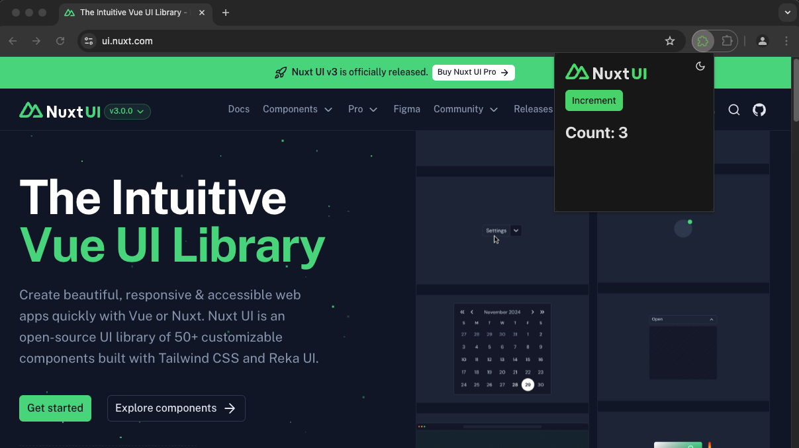

## WXT + Nuxt UI v3 Starter

A minimal starter template for building web extensions with WXT and Nuxt UI v3. This template provides a streamlined setup for developers who want to create beautiful, accessible browser extensions using Vue 3 and the latest version of Nuxt UI.

### Features
- 🚀 Powered by WXT - the next-gen web extension framework
- 🎨 Integrated Nuxt UI v3 components with TailwindCSS v4
- 🔄 Hot Module Replacement (HMR) for rapid development
- 🌐 Cross-browser compatibility (Chrome, Firefox)
- 📦 Optimized build process for extensions
- 🔒 TypeScript support for better code quality
- 🧩 Modular architecture for extension components

### Getting Started

1.	Clone this repository
2.	Run `bun install`
3.	Start development with `bun run dev`

### Documentation
- [WXT Documentation](https://wxt.dev)
- [Nuxt UI Documentation](https://ui.nuxt.com)
